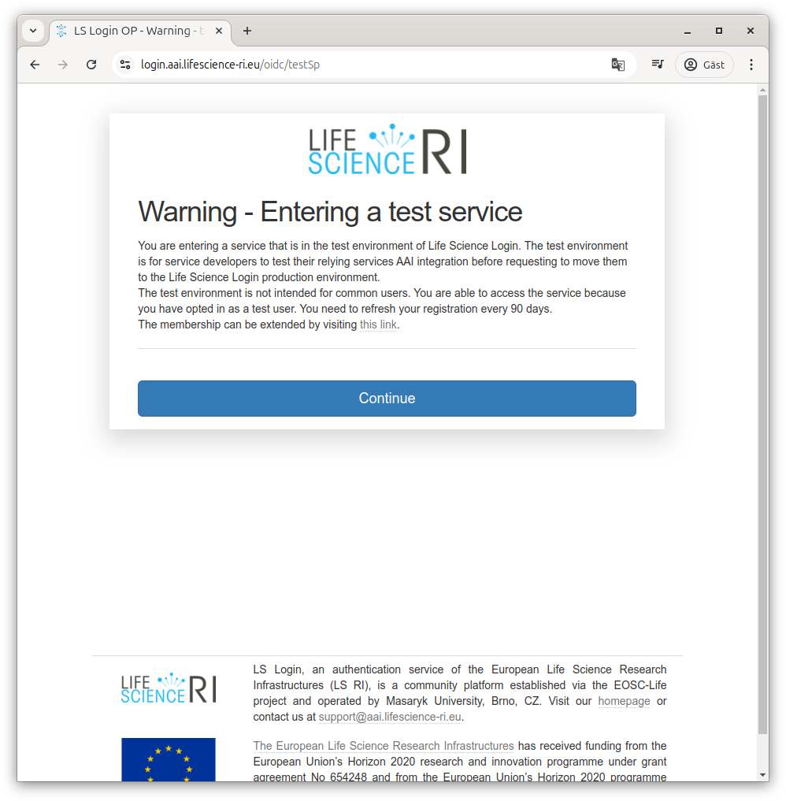

# Doing your first login to DSP

While the Data Science Platform tries not to raise to many hurdles, some things
are required to make a secure system. Keeping track of who is using it is one
such basic thing.

When you go to [the DSP login page](https://dsp.aida.scilifelab.se/) you'll be
greeted by a simple screen where you today only have the choice of
authenticating with [Life Science Login](https://lifescience-ri.eu/ls-login/).

.

## Life Science federation login

If you pass on to Life Science Login, you'll be greeted by a screen where you
can choose between different services, or type the name of your home
organisation to authenticate there if they are available (will likely be the
case for academia).

If your organisation is not available, there are other common services that can
be used for authentication (e.g. ORCID, GitHub, LinkedIn, Google, Apple), or if
you don't want to or are able to use one of these, you can use "LifeScience
Hostel" instead which allows signing up at LS Login directly.

## Using your home organisation e-mail

If you use one of these other services, we recommend changing your profile
e-mail to the one from your home organisation. This can be done on the
[LS Login User Profile site](https://profile.aai.lifescience-ri.eu/); look
for "Preferred mail" and click the pen to update the mail (note that the new
e-mail must be verified which may take some time).

## Multifactor authentication

Once logged in, you would normally be passed back to the service that requested
authentication. But as the DSP is designed to support working with sensitive
data, you will also be required to use multi-factor authentication (somewhat
simpliefied that means just knowing a password should not be enough, typically
something more such as having a physical object should be required).

With Life Science Login, this means you will be asked to provide a second
factor before being able to advance to DSP. From our understanding, Life Science
Login may be able to rely on previous multifactor authentication at your home
organisation, but we have not seen this active.

If Life Science Login needs to do multifactor authentication by itself, you will
be sent to the [Life Science Login MFA site](https://mfa.aai.lifescience-ri.eu/).

.

Since Life Science Login tries to be useful, it supports using modern standards
for authentication over the web. Unfortunately, that may mean you get different
behaviours depending on what web browser you are using, whatever you have any
helper extensions (e.g. password manager), if you have a USB-key connect and
possibly even if you have a phone nearby.

Since those behaviours differ so much, we won't show them.

### Enrolling a new token for multifactor authentication

When arriving at the [MFA site](https://mfa.aai.lifescience-ri.eu/) the first
time, it will tell you who you are authenticated as in Life Science Login and
inform you that you get in without additional credentials this time.

You will then be guided through the enrollment flow, starting with the ability
to name your token.

Next, the flow tries to ensure you have a TOTP application available. It
suggests alternatives for Android and iOS, but you don't need to use those
applications as TOTP is a standard. The list of working apps include Twilio Authy,
Google Authenticator, Microsoft Authenticator, FortiToken, Duo security
authentication, common password managers and many more.

If you do not already use two-factor authentication with an app, we strongly 
recommend choosing one that supports some kind of secure network synchronisation
to handle cases where your device stops working (this should do encryption on
device).

Once you have confirmed you hae an app, it will show you a QR code for easy
addition of the second factor. If you are using a phone, you should be able to
scan that and hopefully have the account added automatically.

If not, you can ask it to reveal the secret as text and add that to your MFA
solution manually.

Once you have added the account to your solution, it should present you with
the current code (this will update regularly, at any time it is requested you
should enter what is currently shown).

If that works, it will remember that you have registered the account on your
side. It calls with that the "token is enrolled"

It will then let you know that multifactor authentication has been activated.

Next, it will inform you about backup codes (in case you loose your phone or
similar). Even if you have a solution that helps with network backup,
downloading backup codes and storing them securely is strongly recommended.

Once you've done that, MFA activation is complete.

## Life Science Login test registration

So far, DSP is running in something called the "test" environment at Life
Science Login while some details are being finalised. In practice, this mostly
mean that you will need to register specially to acknowledge that and accept
a click-through on each invocation.

If you don't register, you'll get an access denied error.

To register, follow the link to registration.

Once you click through, it should acknowledge.

And while it may take a little time, typically on the next attempt you should
get a warning to click through.

## Attribute release

To let you log in to DSP, we need some details from Life Science Login. But
for them to be able to pass them to us, they need you to acknowledge that,

Click "Yes, continue" to let Life Science Login give us those details. If you
want to, you can choose "Remember" not to have to click through that screen
the next time.

## Back at DSP

Once you have authenticated properly, on the first time you return, you will
not be let into DSP as your account needs to be assigned membership details.
Instead you will receive the message "Login failed: You are not authorized for
any projects or domains."

Once your account has been adjusted to allow log in, the next time you return
you will be let into Horizon.

